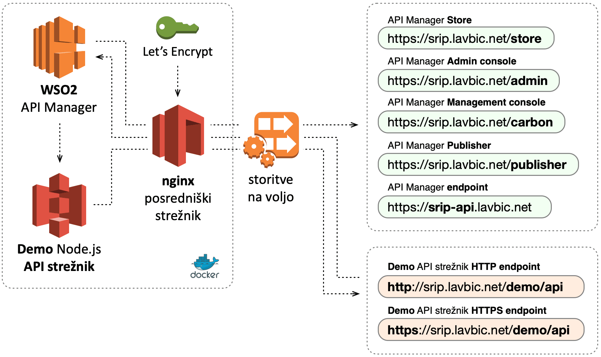

# SRIP PMiS - Komponenta WSO2 tehnološke igralnice

## Navodila

Komponenta je nameščena na spletnem naslovu [https://**srip**.lavbic.net](https://srip.lavbic.net), kjer so na voljo naslednje funkcionalnosti:

* [**Kreiranje in objava API-ja**](https://docs.wso2.com/display/AM210/Create+and+Publish+an+API) je proces povezave obstoječe implementacije API-ja v okviru komponente [_API Manager **Publisher**_](https://srip.lavbic.net/publisher) z namenom obvladovanja in spremljanja življenjskega cikla razvoja API-ja, dokumentacije, varnosti in naročnin. Možno je tudi opredelitev API-ja neposredno v _API Manager **Publisher**_.
* [**Prijava na API**](https://docs.wso2.com/display/AM260/Subscribe+to+an+API) se izvede pred začetkom uporabe API-ja v okviru aplikacije s pomočjo komponente [_API Manager **Store**_](https://srip.lavbic.net/publisher). Naročnina omogoča pridobitev dostopnega žetona, s pomočjo katerega poteka overitev uporabnika oz. aplikacije pri klicu metod API-ja.
* [**Klic API-ja preko integrirane API konzole**](https://docs.wso2.com/display/AM260/Invoke+an+API+using+the+Integrated+API+Console), kjer je v okviru komponente [_API Manager **Store**_](https://srip.lavbic.net/publisher) vključeno [Swagger UI](https://swagger.io/tools/swagger-ui/) orodje, s pomočjo katerega lahko testiramo poljubne metode objavljenih API-jev.
* [**Urejanje in uporaba API-jev s pomočjo Swagger orodij**](https://docs.wso2.com/display/AM260/Edit+and+Consume+APIs+using+Swagger+Tools), kjer je v okviru komponente [_API Manager **Store**_](https://srip.lavbic.net/publisher) vključeno orodje [Swagger Editor](https://editor.swagger.io/), s pomočjo katerega lahko dodajamo in urejamo OpenAPI specifikacijo izbranega API-ja.
* [**Dodajanje API dokumentacije**](https://docs.wso2.com/display/AM260/Add+API+Documentation+In-line%2C+using+a+URL+or+a+File) v okviru komponente [_API Manager **Publisher**_](https://srip.lavbic.net/publisher) je namenjeno lažjemu razumevanju uporabe funkcionalnosti API-ja ter je na voljo na digitalni tržnici API-jev. Možno je dodati različne vrste dokumentacije in raznih virov, kjer imajo vsi vključeni dokumenti enoličen URL naslov za lažje obvladovanje SEO.
* [**Obvladovanje življenjskega cikla API-ja**](https://docs.wso2.com/display/AM260/Publish+the+New+Version+and+Deprecate+the+Old), kjer lahko v okviru komponente [_API Manager **Publisher**_](https://srip.lavbic.net/publisher) objavimo nov API, ki je na voljo v digitalni tržnici. Neposredno je podprta objava nove verzije API-ja, medtem ko lahko predhodnje verzije postopoma odstranimo iz uporabe, medtem ko še vedno omogočimo omejeno uporabo.
* [**Onemogočanje prijave na API**](https://docs.wso2.com/display/AM260/Block+Subscription+to+an+API) lahko izvedemo v okviru komponente [_API Manager **Publisher**_](https://srip.lavbic.net/publisher), s čimer lahko vplivamo na njeno uporabo in monetizacijo.
* [**Objava WebSocket API-ja**](https://docs.wso2.com/display/AM260/Create+a+WebSocket+API) je podprta v okviru komponente [_API Manager **Publisher**_](https://srip.lavbic.net/publisher) in omogoča dvosmerno komunikacijo med odjemacem in strežnikom v okviru ene povezave. Omogoča nam zmanjšanje nepotrebnega omrežnega prometa in je del HTML5 specifikacije.

## Video predstavitev

  
   Pregled funkcionalnosti <b>WSO2 API Manager</b>

## Demo račun

Za testiranje komponente WSO2 tehnološke igralnice so na voljo **3 uporabnika z različnimi ravnmi dostopa**, in sicer:

* **anonimni** uporabnik,
* **registriran** uporabnik,
  * uporabniško ime: **sripdemo**,
  * geslo: **sripdemo**,
* **skrbnik**,
  * uporabniško ime: **admin**,
  * geslo: **admin**.

**Dostop do posameznih funkcionalnostih glede na različne uporabnike** je prikazan v naslednji tabeli:

Funkcionalnost | Anonimni uporabnik | Registriran uporabnik | Skrbnik
:--------------|:------------------:|:---------------------:|:------:
[_**Demo** REST API_](https://srip.lavbic.net/demo/api) | :white_check_mark: | :white_check_mark: |
[_API Manager **Publisher**_](https://srip.lavbic.net/publisher) za objavo novih storitev v digitalno tržnico. | | :white_check_mark: | :white_check_mark:
[_API Manager **Store**_](https://srip.lavbic.net/publisher) za pregled in napredno iskanje po objavljenih storitvah ter generiranje ključev za testiranje in neposredno izvajanje znotraj digitalne tržnice. | :white_check_mark: | :white_check_mark: | :white_check_mark:
[_**Admin Console**_](https://srip.lavbic.net/admin) za urejanje ključnih vsebinskih nastavitev digitalne tržnice. | | | :white_check_mark:
[_**Carbon Management Console**_](https://srip.lavbic.net/carbon) za obvladovanje identitet in funkcionalnost nadzorne plošče sistema. | | :white_check_mark: | :white_check_mark:

## Ustvarjanje računa

Pri pregledu in testiranju objavljenih storitev je v okviru _**API Manager Store**_ možna registracija novega uporabnika, in sicer je na voljo na [https://srip.lavbic.net/store/site/pages/**sign-up**.jag](https://srip.lavbic.net/store/site/pages/sign-up.jag).

## Primeri uporabe

* _**Demo REST API**_ s področja **slovenskih krajev** s pripadajočimi poštnimi številkami in GPS koordinatami, ki omogoča iskanje in manipulacijo s podatki ter je na voljo na [https://srip.lavbic.net/**demo/api**](https://srip.lavbic.net/demo/api).
* **Objava novih storitev** v digitalno tržnico z orodjem _API Manager **Publisher**_, ki je na voljo na [https://srip.lavbic.net/**publisher**](https://srip.lavbic.net/publisher).
* **Pregled** in **napredno iskanje** po **objavljenih storitvah** ter generiranje ključev za testiranje in neposredno izvajanje znotraj digitalne tržnice z orodjem _API Manager **Store**_, ki je na voljo na [https://srip.lavbic.net/**store**](https://srip.lavbic.net/store).
* **Urejanje** ključnih **vsebinskih nastavitev digitalne tržnice** z orodjem _**Admin console**_, ki je na voljo na [https://srip.lavbic.net/**admin**](https://srip.lavbic.net/admin).
* Obvladovanje identitet in **nadzorna plošča** za skrbnike sistema z orodjem _**Carbon management console**_, ki je na voljo na [https://srip.lavbic.net/**carbon**](https://srip.lavbic.net/carbon).

## Namestitev v lastnem okolju

Namestitev je možna s pomočjo **Docker virtualizacijskega okolja**, kjer je, kot prikazuje slika, na voljo več komponent:

* _**WSO2** API Manager_,
* _**Demo** Node.js **API strežnik**_,
* _**nginx** posredniški strežnik_ in
* _Let's Encrypt_.

Vse komponente se namesti na en strežnik, kjer treba poskrbeti zgolj za DNS naslova `srip.lavbic.net` in `srip-api.lavbic.net` (lahko se jih poljubno spremeni) na katerih so na voljo storitve _**WSO2** API Manager_ in _**demo** Node.js **API strežnika**_, kot prikazuje slika.

[Podrobnosti namestitve in konfiguracije](/docker) so na voljo v [`docker-compose.yml`](/docker/docker-compose.yml) datoteki z referencami na vse odvisne komponente, vključno z izgradnjo **demo** Node.js **API strežnika** v datoteki [`Dockerfile`](/docker/data/node/Dockerfile).

## Potrebna predznanja

* [aplikacijski programski vmesnik **(API)**](https://en.wikipedia.org/wiki/Application_programming_interface),
* [specifikacija **OpenAPI**](https://swagger.io/specification) &rarr; zaželjeno,
* [objektna notacija za JavaScript **(JSON)**](https://en.wikipedia.org/wiki/JSON) &rarr; zaželjeno,
* [razširljiv označevalni jezik **(XML)**](https://en.wikipedia.org/wiki/XML) &rarr; zaželjeno.
