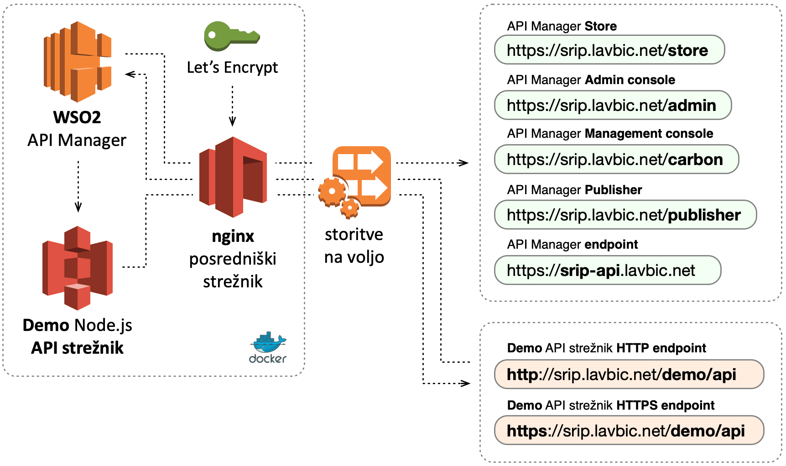
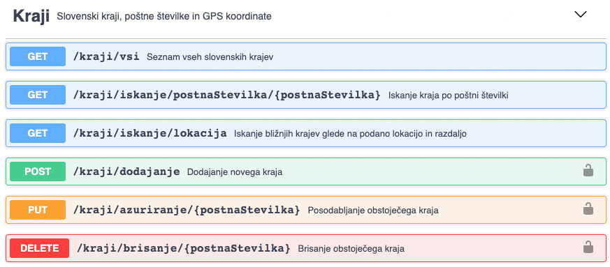
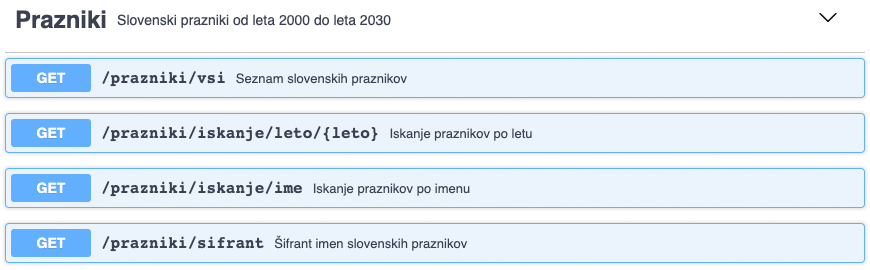
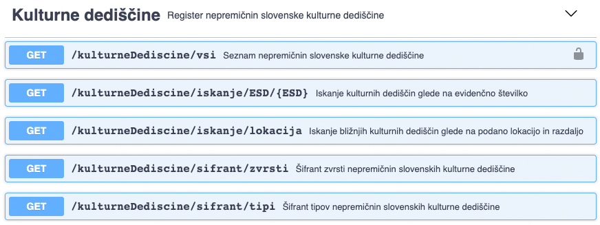
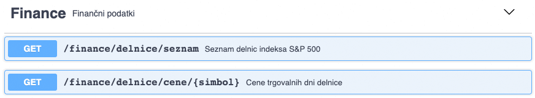

# WSO2 API Manager + demo Node.js API strežnik + nginx + SSL (Let's Encrypt)



V okviru namestitve s pomočjo **Docker virtualizacijskega okolja** je na voljo več komponent:

* [_**WSO** API Manager_](#wso2-api-manager),
* [_**Demo** Node.js **API strežnik**_](#demo-nodejs-api-strežnik),
* [_**nginx** posredniški strežnik_](#nginx-posredniški-strežnik) in
* [_Let's Encrypt_](#lets-encrypt).

Konfiguracija celotne postavitve je na voljo v datoteki [`docker-compose.yml`](docker-compose.yml), kjer je možno spreminjati globalne odvisnosti med komponentami.


## Opis komponent


### WSO2 API Manager

_**WSO2 API Manager**_ temelji na uradni docker sliki [`wso2/wso2am:2.6.0`](https://hub.docker.com/r/wso2/wso2am), medtem ko je dodatna konfiguracija na voljo v treh datotekah `data/wso2/repository/deployment/server/jaggeryapps/{aplikacija}/site/conf/site.json`, kjer `{aplikacija}` predstavlja posamezno komponento WSO2 API Manager-ja, in sicer `admin` ([`site.json`](data/wso2/repository/deployment/server/jaggeryapps/admin/site/conf/site.json)), `publisher` ([`site.json`](data/wso2/repository/deployment/server/jaggeryapps/publisher/site/conf/site.json)) in `store` ([`site.json`](data/wso2/repository/deployment/server/jaggeryapps/store/site/conf/site.json)).

Za potrebe lastne namestitve je treba v vseh treh `site.json` datotekah prilagoditi DNS oz. IP naslov strežnika, ki je javno dostopen, v okviru nastavitve `host`.

```
"reverseProxy" : {
  "enabled" : true,
  "host" : "srip.lavbic.net",
  ...
},
```

Prav tako je treba poskrbeti za naslov dostopne točke v datoteki `api-manager.xml`.

```
<GatewayEndpoint>https://srip-api.lavbic.net</GatewayEndpoint>
```

Privzet skrbniški dostop do _**WSO2 API Manager**_ je:

* uporabniško ime: **`admin`**,
* geslo: **`admin`**,

in sicer se lahko dostopa do naslednjih storitev:

* _**API Manager Publisher**_ &rarr; [https://srip.lavbic.net/**publisher**](https://srip.lavbic.net/publisher),
* _**API Manager Store**_ &rarr; [https://srip.lavbic.net/**store**](https://srip.lavbic.net/store),
* _**Admin console**_ &rarr; [https://srip.lavbic.net/**admin**](https://srip.lavbic.net/admin),
* _**Carbon Managmeent console**_ &rarr; [https://srip.lavbic.net/**carbon**](https://srip.lavbic.net/carbon),

medtem ko so objavljene storitve na voljo preko **WSO2 API Manager Gateway**:

* varna HTTP + SSL povezava &rarr; [**https**://**srip-api**.lavbic.net](https://srip-api.lavbic.net).


### Demo Node.js API strežnik

_**Demo Node.js API strežnik**_ ponuja množico testnih REST API spletnih storitev za potrebe demonstracije. Problemska domena so **slovenski kraji**, kjer slika prikazuje vse metode, ki so na voljo. Gre za enostaven seznam slovenskih krajev s pripadajočimi poštnimi številkami in GPS koordinatami (zemljepisna širina in dolžina).

Izvorna koda demo Node.js API strežnika je na voljo v mapi [`data/node`](data/node). Strežnik je implementiran je v datoteki [`server.js`](data/node/server.js), podatki v [`SI.txt`](data/node/SI.txt), [`prazniki-in-dela-prosti-dnevi.csv`](data/node/prazniki-in-dela-prosti-dnevi.csv), [`register-nepremicnin-kulturne-dediscine.csv`](data/node/register-nepremicnin-kulturne-dediscine.csv), [`yahoo.finance`](data/node/yahoo.finance) in [`Dockerfile`](data/node/Dockerfile), ki poskrbi za izvajanje Node.js strežnika na [`node:10-alpine`](https://hub.docker.com/_/node) Docker sliki.

Funkcionalnost je na voljo na spletnem naslovu [`https://srip.lavbic.net/demo/api`](https://srip.lavbic.net/demo/api), kjer lahko v okviru komponente [nginx posredniških strežnik](#nginx-posredniški-strežnik) spremenite DNS naslov strežnika iz `srip.lavbic.net` in relativno pot `/demo/api` na poljubno vrednost.

Dokumentacija objavljenih metod po **specifikaciji OpenAPI 3.0** je na voljo na [`/demo/api/docs`](https://srip.lavbic.net/demo/api/docs), medtem ko je izvorna koda dokumentacije na voljo na [`/demo/api/swagger.json`](https://srip.lavbic.net/demo/api/swagger.json).

Na voljo so 4 različni vsebinski sklopi testni metod, in sicer: **kraji**, **prazniki**, **kulturne dediščine** in **finance**.


#### Kraji



Zbirka podatkov vključuje slovenske kraje, poštne številke in GPS koordinate. Po omenjenih podatkih je možno poizvedovati s pomočjo naslednjih **GET metod**:

* `/kraji/vsi` vrača seznam vseh krajev,
* `/kraji/iskanje/postnaStevilka/{postnaStevilka}` omogoča iskanje po poštni številki, ki je podana v obliki parametra poti,
* `/kraji/iskanje/lokacija` omogoča iskanje bližnjih krajev glede na podano lokacijo in razdaljo iskanja, kjer so parametri podani v obliki parametrov zahteve.

Na voljo so tudi metode za manipulacijo s podatki, ki zahtevajo avtentikacijo uporabnika, in sicer **POST**, **PUT** in **DELETE metode**:

* `/kraji/dodajanje` omogoča dodajanje novega kraja, ki je podan v obliki JSON objekta v zahtevi,
* `/kraji/azuriranje/{postnaStevilka}` omogoča spreminjanje obstoječega kraja, ki je identificiran v obliki parametra poti, spremenjene vrednosti pa podane v obliki JSON objekta v zahtevi,
* `/kraji/brisanje/{postnaStevilka}` omogoča brisanje obstoječega kraja, ki je določen v obliki parametra poti.


#### Prazniki



Zbirka podtkov vključuje slovenske praznike od leta 2000 do leta 2030. Po omenjenih podatkih je možno poizvedovati s pomočjo naslednjih **GET metod**:

* `/prazniki/vsi` vrača seznam slovenskih praznikov,
* `/prazniki/iskanje/leto/{leto}` omogoča iskanje po koledarskem letu, ki je podan v obliki parametra poti,
* `/prazniki/iskanje/ime` omogoča iskanje po imenu, ki je podan v obliki parametra zahteve,
* `/prazniki/sifrant` vrača šifrant imen slovenskih praznikov.


#### Kulturne dediščine



Zbirka podatkov predstavlja register nepremičnin slovenske kulturne dediščine. Po omenjenih podatkih je možno poizvedovati s pomočjo naslednjih **GET metod**:

* `/kulturneDediscine/vsi` vrača seznam nepremičnin slovenske kulturne dediščine in zahteva avtentikacijo uporabnika,
* `/kulturneDediscine/iskanje/ESD/{ESD}` omogoča iskanje kulturnih dediščin po evidenčni številki, ki je podana v obliki parametra poti,
* `/kulturneDediscine/iskanje/lokacija` omogoča iskanje bližnjih nepremičnin kulturne dediščine glede na podano lokacijo in razdaljo iskanja, kjer so parametri podatni v obliki parametrov zahteve.
* `/kulturneDediscine/sifrant/zvrsti` vrača šifrant zvrsti nepremičnin slovenske kulturne dediščine,
* `/kulturneDediscine/sifrant/tipi` vrača šifrant tipov nepremičnin slovenske kulturne dediščine.


#### Finance



Zbirka podatkov predstavlja finančne podatke zadnjih 20 let z ameriškega delniškega trga. Po omenjenih podatkih je možno poizvedovati s pomočjo **GET metod**:

* `/finance/delnice/seznam` vrača seznam delnic ameriškega indeksa S&P 500,
* `/finance/delnice/cene/{simbol}` vrača cene trgovalnih dni izbrane delnice, ki je je podana v obliki parametra poti in začetnega ter končnega datuma, ki sta podana kot parametra zahteve.

Za testiranje storitev, ki zahtevajo avtentikacijo, je na voljo tudi **POST metoda**:

* `/avtentikacija/prijava`, ki omogoča prijavo uporabnika z uporabniškim imenom (`sripdemo`) in geslom (`sripdemo`) v obliki JSON objekta v zahtevi, kot odgovor pa vrne JWT žeton za dostop.


### Nginx posredniški strežnik

_**Nginx posredniški strežnik**_ temelji na Docker sliki [`nginx`](https://hub.docker.com/_/nginx), ki je integrirana s samodejnim obnavljanje SSL certifikator preko ponudnika [Let's Encrypt](https://letsencrypt.org/) in je podrobneje opisan v naslednjem poglavju [Let's Encrypt](#lets-encrypt).

Konfiguracija nginx posredniškega strežnika je na voljo v datoteki [`app.conf`](data/nginx/conf/app.conf), ki se nahaja v mapi [`data/nginx/conf`](data/nginx/conf). Ključna funkcionalnost je

V konfiguraciji datoteke `app.conf` je treba spremeniti vse reference na spletna naslova `srip.lavbic.net` in `srip-api.lavbic.net` ter jih nadomestiti z lastnimi.

Ta komponenta je tudi edina izmed vseh predstavljenih, ki storitve izpostavlja na javnem vmesniku, in sicer sta to vrata `80` (protokol **HTTP**) in `443` (protokol **HTTPS**), kjer se vse zahteve po protokolu **HTTP samodejno preusmerijo na protokol HTTPS**.


### Let's Encrypt

Komponenta _**Let's Encrypt**_ temelji na Docker sliki [`certbot/certbot`](https://hub.docker.com/r/certbot/certbot/) in skrbi za pridobitev brezplačnih SSL certifikator ponudnika Let's Encrypt in kasneje tudi za obnovitev.

Za začetno kreiranje SSL certifikatov (brez tega se namreč nginx strežnik z SSL podporo ne zažene) je na voljo skripta [`init-letsencrypt.sh`](init-letsencrypt.sh), kjer je treba zgolj spremeniti vrednosti `domains` in `email`:

```
domains=(srip.lavbic.net srip-api.lavbic.net)
rsa_key_size=4096
data_path="./data/certbot"
email="dejan@lavbic.net"
```

Po inicializaciji sta komponenti _**Let's Encrypt**_ in _**nginx posredniški strežnik**_ povezani preko datotečnega sistema, in sicer mape `data/certbot`. _**Let's Encrypt**_ v tem primeru skrbi za redno obnavljanje brezplačnih SSL certifikatov, ki jih _**nginx posredniški strežnik**_ potrebuje pri svojem delovanju strežbe vsebine preko HTTPS protokola.


## Navodila za namestitev

Za namestitev celotnega sistema je treba najprej v skladu z [opisom komponent](#opis-komponent) poskrbeti za spremembo ustreznih DNS naslovov, kjer bo sistem nameščen.

Pred zagonom sistema je treba najprej inicializirati **SSL certifikate**, kot je to opisano v poglavju [Let's Encrypt](#lets-encrypt), in sicer:

```
init-letsencrypt.sh
```

Nato z naslednjim ukazom poženemo vse povezane vsebnike v ozadju:

```
docker-compose up -d
```

Če želimo vse povezane vsebnike ustaviti, uporabimo naslednji ukaz.

```
docker-compose stop
```


## Vzdrževanje sistema


Če želimo pregledati **dnevniške zapise** posameznega Docker vsebnika (npr. komponente WSO2 API Manager), lahko to dosežemo z naslednjim ukazom:

```
docker logs srip-wso2-am --follow
```

Za naprednejše administriranje lahko z naslednjim ukazom pridobimo tudi **terminalskega dostopa** do Docker vsebnika:

```
docker exec -it srip-wso2-am bash
```
